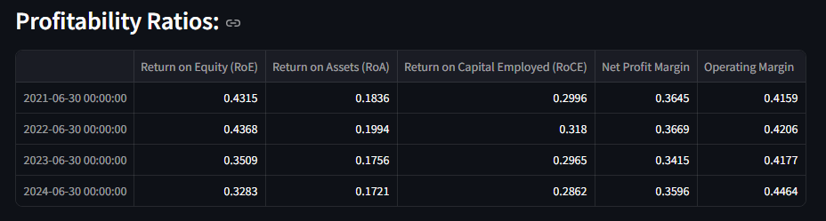
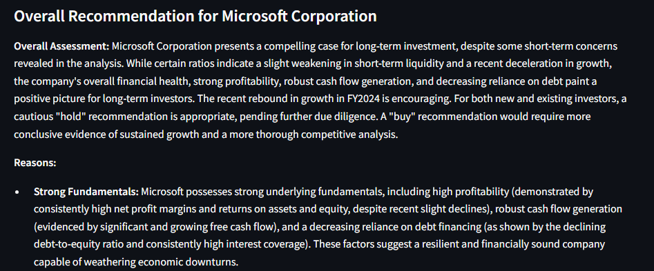
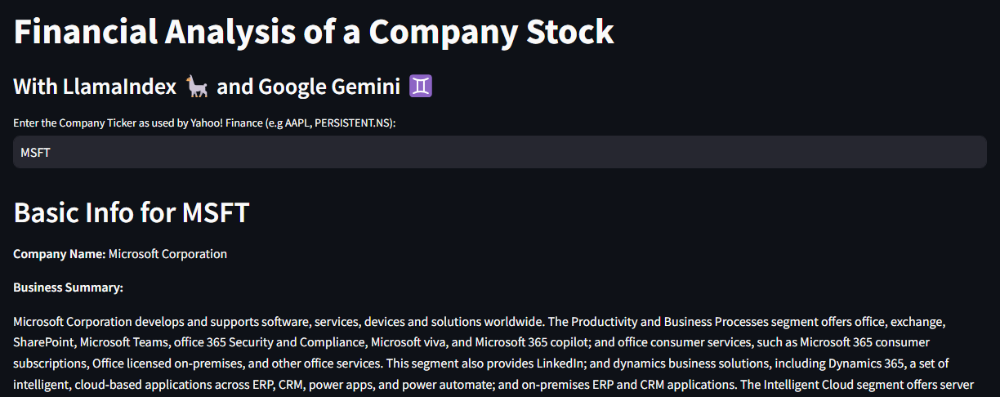
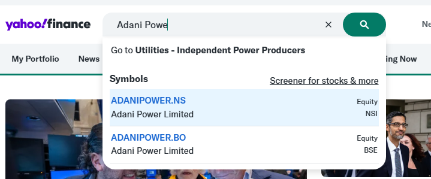

# Financial Analysis of a Company Stock
### Using LlamaIndex 🦙 and Google Gemini ♊
This example shows you how you can use a LLM to analyze financial performance metrics of any company and give you an overall recommendation on the long term investment potential of the company. Such type of use-cases could be helpful to financial advisors making stock investment recommendations to pensioners or HNIs.

<table style="background-color:#ffe4e1; width:100%;">
  <tr>
    <td style="color:black; text-align:center;">
      <b>Warning:</b> This code is for illustration purposes only. It is not meant to
      replace or replicate the advise of a skilled Financial Advisor. <b>Do not make
      any financial investments decisions based on the recommendations you see here</b>.
      Always do your own independent research and seek professional advise before investing
      your hard-earned money.
    </td>
  </tr>
</table>

Analyzing a company as potential long term investment is a very tedious process. You have to pour through financial reports, read latest news and recommendatios, do your independent research before deciding on how to proceed. 

This example calculates various financial ratios, as detailed below, from data downloaded from Yahoo! Finance. It leverages Google Gemini LLM (we use `gemini-1.5-flash`) to analyze all the ratios we calculate and make an overall recommendation on the investment potential. All you do is provide the stock symbol used by Yahoo! Finance (such as AAPL for Apple, AMZN for Amazon, RELIANCE.NS for Reliance Industries and so on). <b>For now, analysis is limited to publicly traded companies</b>

### Financial Ratios Analyzed
1. **Liquidity Ratios**: such as Current Ratio, Quick Ratio and Cash Ratio, which help assess the short-term stability of a company.
2. **Profitability Ratios**": such as Return on Equity (RoE), Return on Assets (RoA), Return on Capital Employed (RoCE), Net Profit Margin, and Operating Margin, which help assess potential earnings and returns from the company.
3. **Efficiency Ratios**: such as Asset Turnover Ratio and Inventory Turnover, which measure operational efficiency of a company. **NOTE:** not all companies provide inventory information.
4. **Valuation Ratios**: such as Price-to-Earnings ratio (P/E), Price-to-Sales ratio (P/S), Price-to-Book ratio (P/B), EV/EBIDTA ratio, which is intended to measure stock price "fairness".
5. **Leverage Ratios**: such as Debt-to-Equity ratio (D/E) and Interest Coverage Ratio, which helps assess the debt risk of a company.
6. **Performance and Growth Metrics**: such as Revenue Growth (%), EBIT Growth (%), EPS Growth (%), FCF (Free Cash Flow) Growth (%), Net Profit Margin, Earnings Per Share (EPS), Debt to Equity (D/E) and Free Cash Flow, which are intended to measure business growth, profitability, earnings potential, financial stability, and cash flow generation of a company.

Each ratio, under each group, is calculated at financial-year-end for the past 4-5 years (limitation of Yahoo! Finance API). For example, here is a table that displays Profitability Ratios for one of the companies being analyzed.

For each ratio group, there is a call out to the Gemini LLM ♊, asking it to analyze each ratio and revert with observations.

Finally, the LLM gives it's recommendation based on all the financial ratios calculated and it's analysis of each group of ratios. Here is an example (_partly shown_) of the kind of feedback you'd get for Microsoft Corporation stock. The model gives you an overall recommendation + reasons for the same. Nice no 😍?

### Setup

* To run this app, you should install the Python modules listed in `requirements.txt` file in the application folder.  For this application, I have used **yfinance** to download stock information and **llama index** for LLM interface. 
* I have used Google Gemini ♊ as my LLM because the analysis report can get very long (here's where Gemini's 1 Mn Context window helps!), and because Gemini API is still free 😀🤞.  I have used `gemini-1.5-flash` as the LLM, but `gemini-2.0-flash` should work too - try it out!  You'll need an API key to use Gemini API. Head on over to [Google AI Studio](https://aistudio.google.com/app/apikey?_gl=1*1veje4l*_ga*MTQyMjk5NjM3NC4xNzM4NTY1NTg4*_ga_P1DBVKWT6V*MTczOTI0ODgyMy41LjAuMTczOTI0ODgyMy42MC4wLjEzNDM3OTY5ODE.), create an API key and paste it into a local `.env` file with a GOOGLE_API_KEY key, like so  
`GOOGLE_API_KEY=<Your_API_key from Google AI Studio website>`

### Running the app
* Switch to the folder containing this applications code   **NOTE:** it's the `src\FinancialAnalyst` subfolder!
* On the command line, type the following: 
`streamlit run app.py`
* It will run in a new tab in your browser.

Here is an image of the app:

1. I typed in `MSFT` (the stock symbol for Microsoft Corporatio) as an example and hit enter.
2. You should see response in some time - it's quite long, so could take a few minutes to generate (just a few minutes dependig on your internet speed)
3. Scroll through the respose to see the ratios calculations and LLM's recommendation at each stage.
4. At the very bottom, you'll see the overall recommedation.

You can try with other stock symbols (e.g. AAP for Apple, AMZN for Amazon, RELIANCE.NS for Reliance Industries, TCS.NS for TCS and so on) - visit [Yahoo! Finance](https://finance.yahoo.com/) home page and search for a company by name in the very top search box, to see the stock symbol. Here is an example of me searching for Adani Power - you can see the symbols are `ADANIPOWER.NS` (for NSE) or `ADANIPOWER.BO` (for BSE)

### Conclusion
This is just one of many analysis that Financial Advisors would do before making a recommendation. Apart from Financial Analysis, they would also earnings call transcripts, investor presentations, credit reports and so on. Hope you find this useful as an example of how you can leverage an LLM to automate some of the investment analysis workflows.