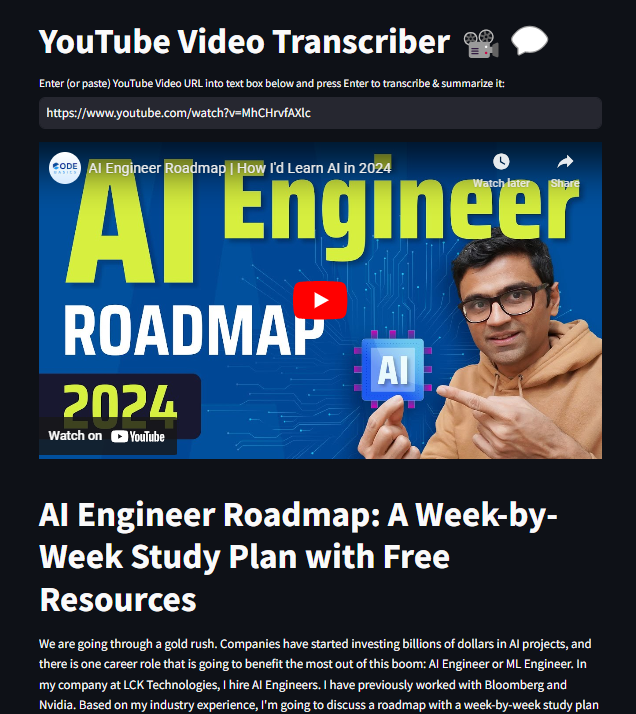
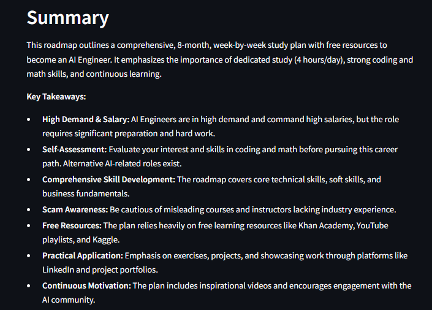

# YouTube Video Transcriber 📽️💬
This example shows you **how to transcribe and summarize a YouTube Video** given its URL using Google Gemini. 

I love watching technical videos on YouTube 😉. However, I don't necessarily have the patience
to sit through an entire video. Sometimes I just want a summary of the key points in the video
to keep as notes (or even decide if I want to watch the entire video in the first place!).

This is a quick utility program that helps me do just that. It's coded with a simple `streamlit` UI where you enter the URL of a YouTube video and press ENTER. It will then show you the video itself, followed by a well formatted transcript of the video, followed by a summary of the transcript. I normally jump to the summmary to decide if I should watch the video in the first place 😎. If the summary looks exciting, I can watch the video without jumping to YouTube!

### Setup

* To run this app, you should install the Python modules listed in `requirements.txt` file in the application folder.  For this application, I have used **YouTube Transcript API** to transcribe the video. 
* I have used Google Gemini as my LLM because the transcript can be long depending on video (here's where Gemini's 1 Mn Context window helps!), and because Gemini API is still free 😀🤞.  I have used `gemini-1.5-flash` as the LLM, but `gemini-2.0-flash` should work too - try it out!  You'll also need an API key to use Gemini API. Head on over to [Google AI Studio](https://aistudio.google.com/app/apikey?_gl=1*1veje4l*_ga*MTQyMjk5NjM3NC4xNzM4NTY1NTg4*_ga_P1DBVKWT6V*MTczOTI0ODgyMy41LjAuMTczOTI0ODgyMy42MC4wLjEzNDM3OTY5ODE.), create an API key and paste it into a local `.env` file with a GOOGLE_API_KEY key, like so  
`GOOGLE_API_KEY=<Your_API_key from Google AI Studio website>`

### Running the app
* Switch to the folder containing this application
* On the command line, type the following: 
`streamlit run app.py`
* It will run in a new tab in your browser.

Here is an image of the app - I was transcribing the video [Transformers Explained](https://www.youtube.com/watch?v=ZhAz268Hdpw&t=1203s) video from `codebasics`. Just below the heading, you paste in the YouTube URL and press Enter to see a well formatted transcript followed by a summary.

**NOTE:** This could take a while depending on length of the video!

And here is the summary (or at least part of it), which helped me decide that this video is indeed worth watching till the end 😍.

BTW: I think [codebasics](https://www.youtube.com/@codebasics) has some excellent vidoes on AI - you should check them out!

